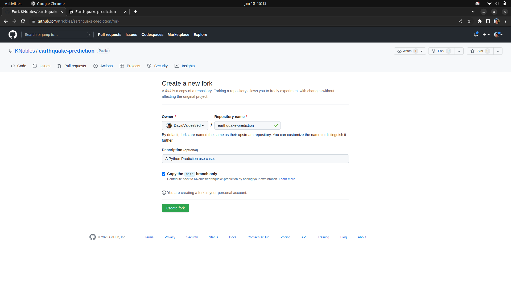
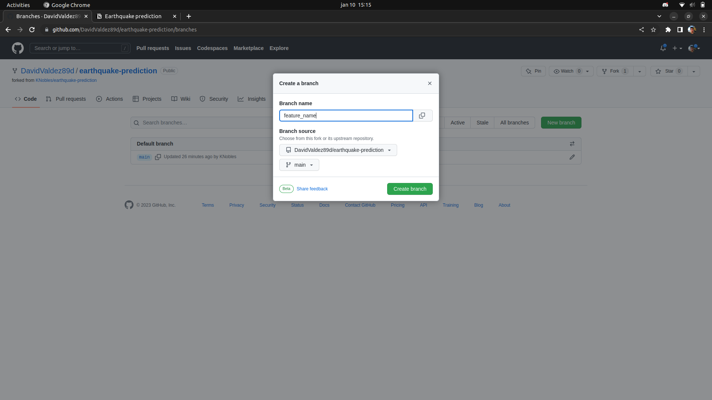
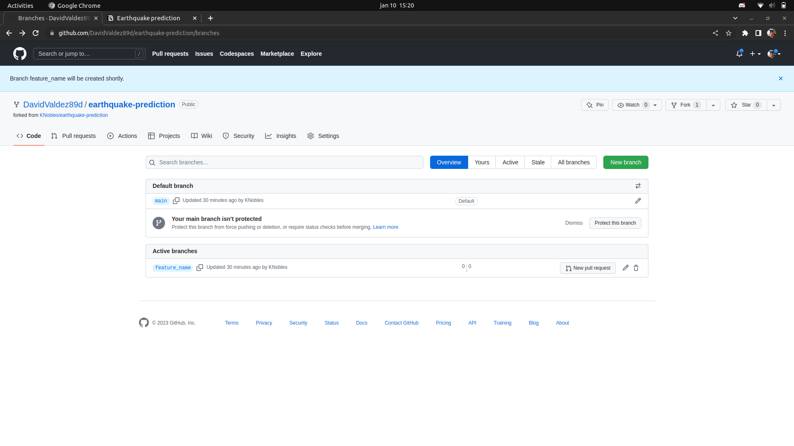
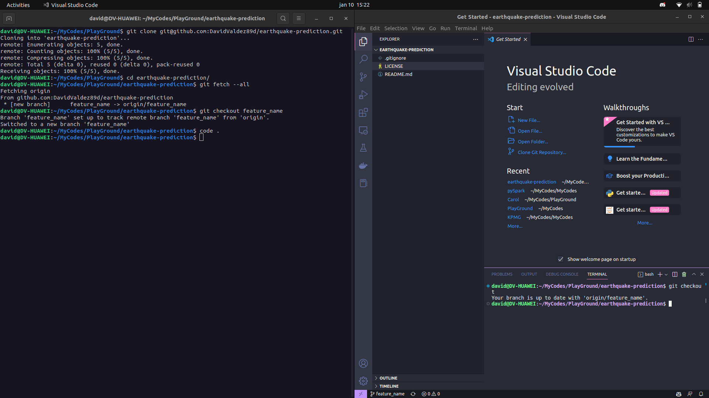
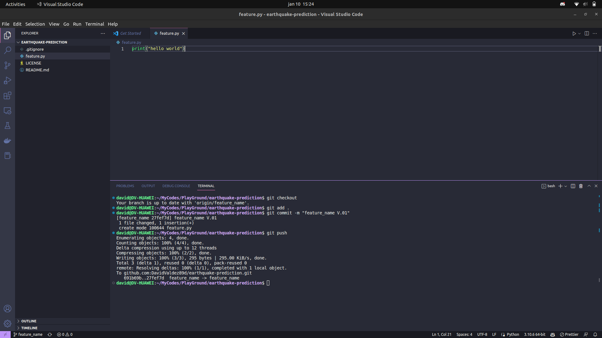
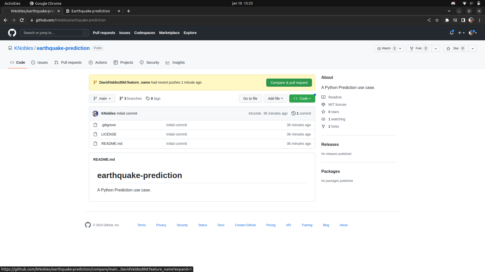
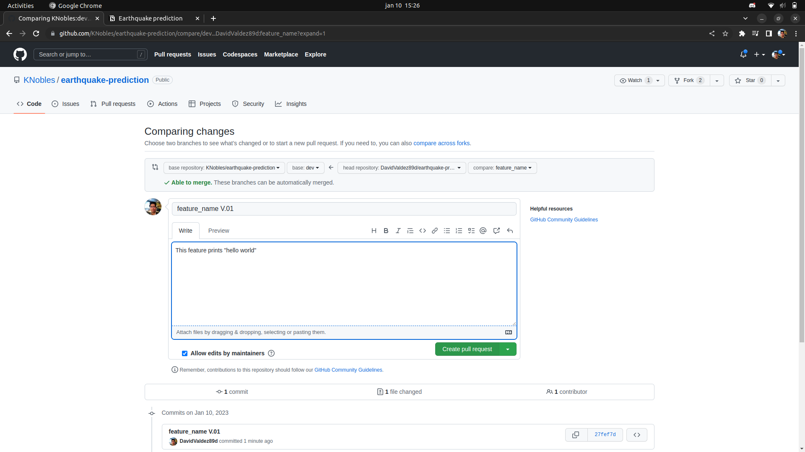
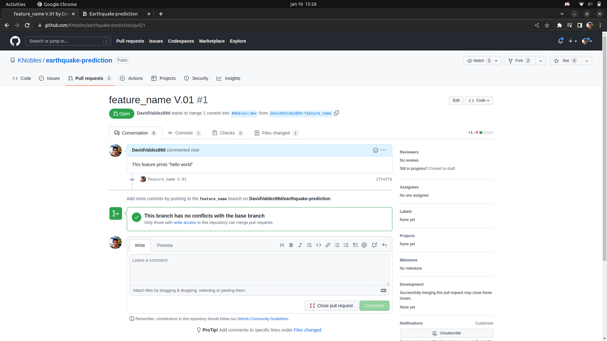

### **Workflow Instructions**

Please follow this steps each time you need to modify the code

**Step 01 Fork**
* Create a fork from KNobles/earthquake-prediction
* Copy the main branch only



**Step 02 Clone project**
* Clone project to your computer
git clone
* ```$ git clone git@github.com:githubUser/earthquake-prediction.git```
 
```
Cloning into 'earthquake-prediction'...
remote: Enumerating objects: 5, done.
remote: Counting objects: 100% (5/5), done.
remote: Compressing objects: 100% (5/5), done.
remote: Total 5 (delta 0), reused 0 (delta 0), pack-reused 0
Receiving objects: 100% (5/5), done.
```
 
You will have to repeat this process everytime that you work in a new feature
 
**Step 03 Create a branch**
* Create a branch, name it as the feature that you will develop. (i.e. prediction)
* Select main branch



 
**Step 04 Fetch**
* ```$ git fetch --all```
```
Fetching origin
From github.com:DavidValdez89d/earthquake-prediction
* [new branch]      feature_name -> origin/feature_name
```
**Step 05 go to branch**
* ```$ git checkout feature_name```
```
Branch 'feature_name' set up to track remote branch 'feature_name' from 'origin'.
Switched to a new branch 'feature_name'
```
**Step 06 open the project**
* Open the project in vscode or jupyter-lab
* ```$ code .``` or ```$ jupyter-lab```
 
**Step 07 check the branch**
* Open a new terminal, and make sure that you are in the correct branch
* ```$ git status```
```
Your branch is up to date with 'origin/feature_name'.
```

 
**Step 08 work on the code**
 
**Step 09 Check that everything works**
* your code is not a notebook
* Your work has comments, inputs and outputs are defined
* You have a requeriments.txt file
 
**Step 10 save the code**
* Save your changes
* Add them to your git ```$ git add .```
* Commit the changes ```$ git commit -m "message"```
```
[readme d426e10] instructions
1 file changed, 64 insertions(+), 2 deletions(-)
rewrite Instructions.md (94%)
```
**Step 10 push to GitHub**
* push your code ```$ git push```
```
Enumerating objects: 5, done.
Counting objects: 100% (5/5), done.
Delta compression using up to 12 threads
Compressing objects: 100% (3/3), done.
Writing objects: 100% (3/3), 1.04 KiB | 1.04 MiB/s, done.
Total 3 (delta 1), reused 0 (delta 0), pack-reused 0
remote: Resolving deltas: 100% (1/1), completed with 1 local object.
To github.com:KNobles/earthquake-prediction.git
  ede8e81..d426e10  readme -> readme
```


 
**Step 11 Communicate the change request to an engineer**
* After pushing your code, it will be reviewed before being added to the main branch.



* If there is any problem with the code, we will contact you.

 

## **Thank you !**

